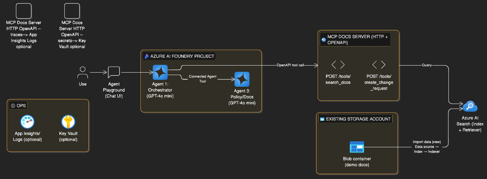

# Azure AI Foundry + MCP (Docs) + Azure AI Search — Meetup Demo

A small demo project for a meetup talk:
- **Two agents** in Azure AI Foundry (Connected Agents)
  - **Agent 1**: Orchestrator
  - **Agent 3**: Policy/Docs specialist
- **Model**: GPT‑4o mini (deployed in the Foundry Project)
- **Docs retrieval**: Azure AI Search (index built using the **Import data (new)** wizard)
- **Tool layer**: a lightweight “MCP Docs Server” that exposes a small tool surface:
  - `search_docs(query, top_k)` → queries Azure AI Search
  - `create_change_request(...)` → writes a change request draft artifact

---

## Architecture




## Component overview

### Azure AI Foundry
- Holds agent definitions and runs (Agent Playground is used as the UI).
- Agent 1 delegates document/policy work to Agent 3 using Connected Agents.

### Azure AI Search
- Stores the searchable index.
- Index built from documents stored in an **existing** Blob Storage account.
- Index creation and ingestion performed through the **Import data (new)** wizard.

### MCP Docs Server (tool service)
- Exposes a small, stable tool interface over HTTP (OpenAPI 3.0, FastMCP).
- Implements retrieval against Azure AI Search.
- Produces a change request draft artifact as JSON/Markdown for the demo.

### Optional Python Agent Host
- Included as an alternative runtime for local development and for function-calling experiments.
- Not required when Foundry uses OpenAPI tools directly.

---

## Project structure

```text
meetup-foundry-mcp-demo/
├─ README.md
├─ .env.example
├─ docker-compose.yml
├─ agents/
│  ├─ agent1-orchestrator/system.md
│  └─ agent3-policy-docs/system.md
├─ scripts/
│  ├─ 00-prereqs-check.sh
│  ├─ 01-upload-docs-to-existing-blob.sh
│  ├─ 02-search-wizard-notes.md
│  ├─ 20_agents_apply.py                 # FunctionTool version (from earlier draft)
│  ├─ 20_agents_apply_openapi.py         # OpenAPI tool version (recommended for Playground UI)
│  └─ 21_agents_delete.py
├─ services/
│  └─ mcp-docs-server/
│     ├─ src/server_http.py
│     ├─ src/tools/search_docs.py
│     ├─ src/tools/create_change_request.py
│     ├─ openapi.yaml
│     ├─ requirements.txt
│     └─ Dockerfile
├─ apps/
│  └─ agent-host-python/                 # optional
│     ├─ src/app.py                      # FastAPI wrapper for runs
│     ├─ src/run_agent.py                # CLI runner
│     └─ requirements.txt
├─ data/
│  ├─ sample_docs/                       # files uploaded to existing Blob container
│  └─ change_requests_out/               # created artifacts
└─ infra/
   └─ azd/                               # optional infra templates (no storage creation)
```

---

## Prerequisites

### Local tools
- Azure CLI
- Python 3.10+ (3.11 recommended)
- Docker Desktop (for container-based local run)
- `azd` (optional, for infra templates)

### Azure prerequisites
- An Azure AI Foundry **Project** with a deployed model named in `MODEL_DEPLOYMENT_NAME` (example: `gpt-4o-mini`).
- An existing Storage Account (Blob) for documents (container example: `demo-docs`).
- An Azure AI Search service.
- Role assignment that allows:
  - calling the Foundry project endpoint with Entra ID credentials
  - reading Blob data for indexing (indexer connection)
  - querying Azure AI Search (API key used for the demo)

---

## Configuration

Copy `.env.example` to `.env` and fill values.

```bash
cp .env.example .env
```

---

## Step-by-step: end-to-end demo setup

### 1) Start the MCP Docs Server locally (fastest smoke test)

```bash
cd services/mcp-docs-server
python -m venv .venv
source .venv/bin/activate
pip install -r requirements.txt
uvicorn src.server_http:app --host 0.0.0.0 --port 8080
```

Health check:

```bash
curl -s http://localhost:8080/health | jq .
```

---

### 2) Upload demo docs to the existing Storage Account (Blob)

Place files into `data/sample_docs/`, then run:

```bash
bash scripts/01-upload-docs-to-existing-blob.sh
```

This script expects `BLOB_ACCOUNT_NAME` and `BLOB_CONTAINER_NAME` in `.env`.

---

### 3) Create the Azure AI Search index via portal wizard

Follow `scripts/02-search-wizard-notes.md`.

Outcome:
- Data source points to the existing Blob container
- Index + indexer created
- Indexer run succeeds at least once

---

### 4) Configure agents in Foundry (recommended path)

Run the OpenAPI-based agent script to create:
- Agent 3 (Policy/Docs)
- Agent 1 (Orchestrator) with:
  - Connected Agent Tool → Agent 3
  - OpenAPI Tool → MCP Docs Server

```bash
python scripts/20_agents_apply_openapi.py
```

The script stores created IDs in `.state/agents.json`.

---

### 5) Test in Foundry Agent Playground

In Azure AI Foundry → Agents → open the **Orchestrator** agent → Try in Playground.

Suggested demo prompts:
- “Is a public endpoint allowed for storage accounts? Provide a short answer with sources.”
- “Draft a change request to enable private endpoints for a storage account; keep it low risk.”

---

## Optional: Python Agent Host mode (function calling)

This mode uses `scripts/20_agents_apply.py` (FunctionTool-based) and a local loop that submits tool outputs.

Create agents:

```bash
python scripts/20_agents_apply.py
```

Run CLI chat:

```bash
cd apps/agent-host-python
python -m venv .venv
source .venv/bin/activate
pip install -r requirements.txt
python src/run_agent.py "Is a public endpoint allowed?"
```

---

## Deployment notes (Azure)

For a meetup, the most stable deployment is:
- MCP Docs Server hosted in **Azure Container Apps** (public ingress for demo)
- Azure AI Search as managed service
- Existing Storage Account as the indexer data source
- Agents configured in Foundry to call MCP Docs Server via OpenAPI tool

Templates in `infra/azd/` are included as a starting point and keep Storage Account creation disabled.

---

## Cleanup

Delete created agents:

```bash
python scripts/21_agents_delete.py
```

---

## Troubleshooting quick list

- Foundry run enters `requires_action`: function calling mode expects the host loop to submit tool outputs.
- Azure AI Search query fails: verify `AZURE_SEARCH_ENDPOINT`, `AZURE_SEARCH_INDEX_NAME`, `AZURE_SEARCH_API_KEY`.
- Indexer fails: verify Blob container access and indexer configuration in the portal wizard.
